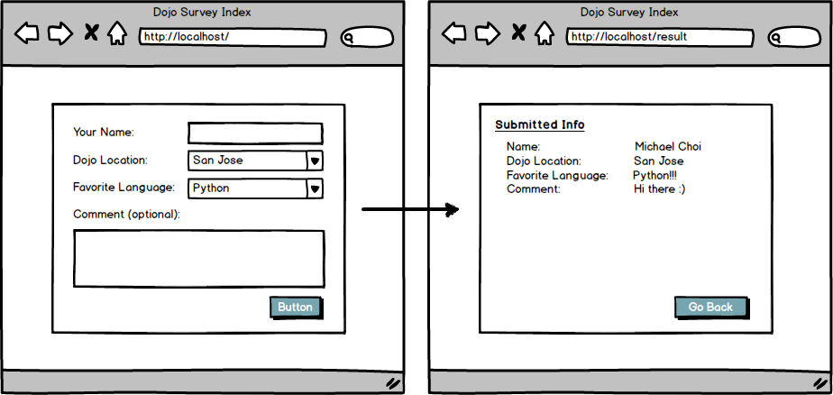

# DOJO SURVEY
This was a practice exercise involving session data and POST requests using Flask
### Objectives:
* Create a new Flask application

* Have the root route ("/") show a page with the form

* Have the "/result" route display the information from the form on a new HTML page

* Put the form data into session

* Use a CSS framework to style your form

* Include a set of radio buttons on your form

* Include a set of checkboxes on your form

## I was given this wireframe as a reference:
